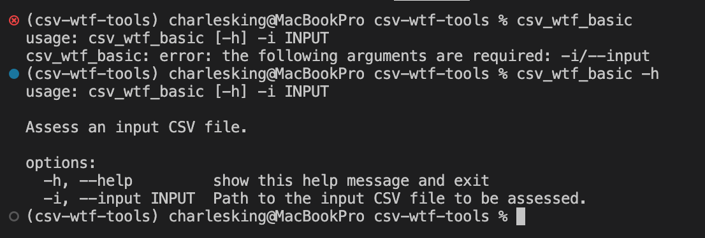
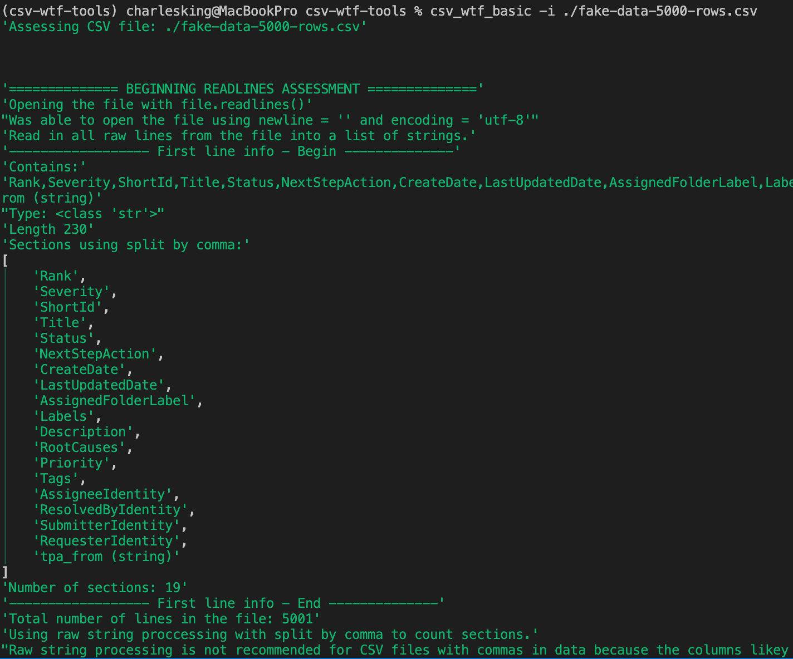

# CSV WTF TOOLS

A collection of small tools to assess CSV files, mostly for troubleshooting.

## Description

Reads a CSV file and attempts to look at it in various ways depending upon the method used to read/load it. The objective is to give the user some info to review to try to identify things that are broken that might be causing issues loading into other tools.

## Installation Dependencies

You must have `git` and `uv` installed to deploy this app to your Windows system.

See how to do that here: https://github.com/cwkingjr/windows-install-gitbash-and-uv

If you are short on Bash/Terminal Knowledge pick some up cheap here: https://github.com/cwkingjr/unix-command-intro-for-windows-folks

### If you already have UV Installed

Update it to the latest version:

```bash
uv self update
```

## Common Installation Extras

If you want to use some command line interface (CLI) tools, but want to be able to use Windows Explorer to drag a file/folder (path) and drop it on an icon to run it with your selection, you can build a Windows Batch file for the CLI app to do that. Learn how here: https://github.com/cwkingjr/windows-drag-to-app-with-args

## CSV WTF Tools Installation, Update, and Removal

### Install

Using the Git Bash Terminal run this command at the shell prompt:

```bash
uv tool install https://github.com/cwkingjr/csv-wtf-tools.git
```

### Upgrade

This is typically only needed when the developer fixes bugs, adds features, or updates the program's dependencies. In any case, it doesn't hurt anything to run it just in case.

```bash
uv tool upgrade csv-wtf-tools
```

### Uninstall

```bash
uv tool uninstall csv-wtf-tools
```

If you made/deployed Windows Batch files to your desktop, you'll need to manually delete those.

### List UV-Managed Tools

```bash
uv tool list
```

## Tools Included

- csv_wtf_basic: Runs basic checks using built-in Python capabilities
- csv_wtf_pandas: Coming soon (maybe)
- csv_wtf_polars: Coming soon (maybe)

### Invoke CSV WTF TOOLS

#### CSV WTF Basic

To run the tools, go to the Git Bash Terminal and run:

```bash
csv_wtf_basic  # with no argument, prints usage help (see image)
csv_wtf_basic -h or --help  # prints the help info (see image)
csv_wtf_basic -i <csv-file-to-assess-path> # replace arrow tags & contents with the file path
csv_wtf_basic --input <csv-file-to-assess-path>  # -i/--input function the same
csv_wtf_basic -i ~/Documents/csv_reports/problem_csv_file.csv  # ~ is replaced by home in bash
csv_wtf_basic --input ~/Documents/csv_reports/problem_csv_file.csv
```

<p align="center"></p>

#### Example CLI Output When Finished

<p align="center"></p>

#### CSV WTF Pandas

Placeholder.

#### CSV WTF Polars

Placeholder.

### Example Batch File

If your system installs this application in the same area as mine does, you should be able to download this file https://github.com/cwkingjr/csv-wtf-tools/blob/main/csv_wtf_basic.bat onto your desktop and use Windows (File) Explorer to drag a CSV file path to it and drop it on the icon to invoke the app. If it doesn't work, see the installation extras section above to reconfigure it for your installation path.
